<p align="center">
  
</p>

<h1 align="center">VersoRefuerzo</h1>

<p align="center">
  <strong>Memorize Bible verses with spaced repetition and mini games.</strong><br />
  Memoriza versículos bíblicos con repetición espaciada y mini juegos.
</p>

<p align="center">
  <a href="https://versorefuerzo.web.app"><strong>Open the app: versorefuerzo.web.app</strong></a><br />
  Free, no ads, Spanish and English, works on phone and desktop.
</p>

<p align="center">
  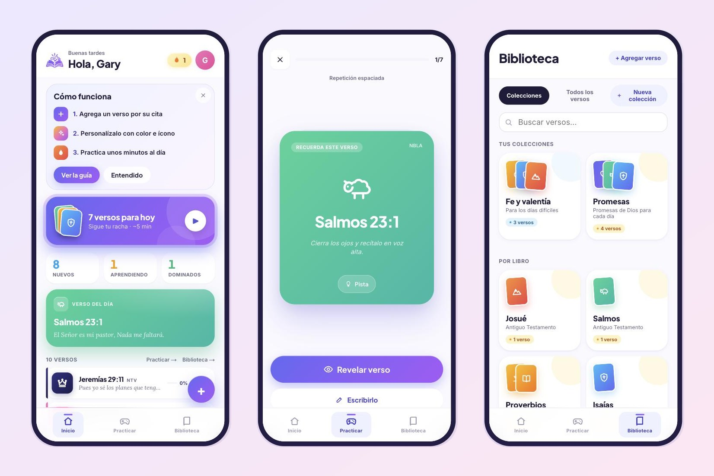
</p>

---

## What it is

VersoRefuerzo turns each Bible verse you want to learn into a flashcard and
tells you when to review it, right before you would forget it. You type a
citation such as `Juan 3:16`, the app fetches the text for you, and you
practice a few minutes a day through a classic flashcard mode and four
mini games.

It is a non-profit project: free to use, no ads, no tracking, and every
user's library is private.

## Screenshots

| | |
| --- | --- |
| 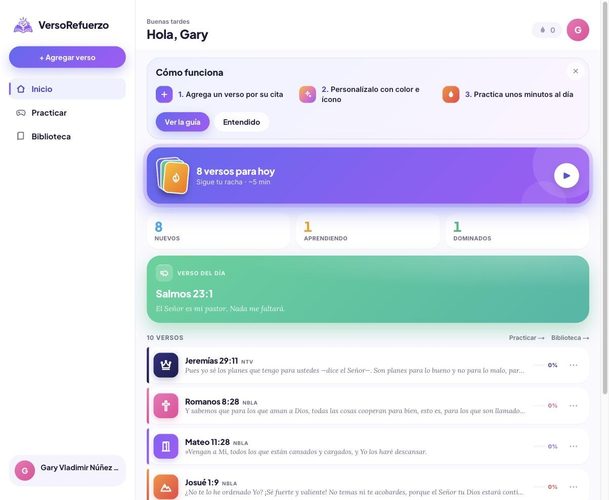 | 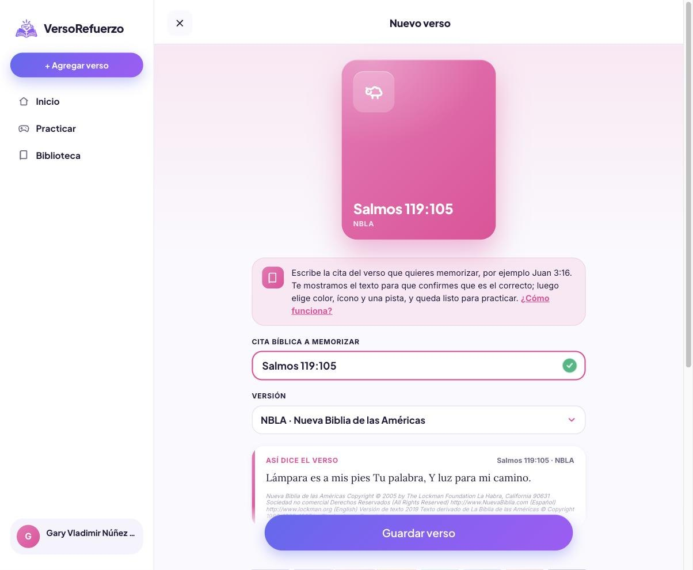 |
| **Home.** How many verses are due today, the streak, progress counts, a verse of the day and the recent list. | **Add a verse.** Type a citation, pick a version and the text is previewed live before saving. |
| 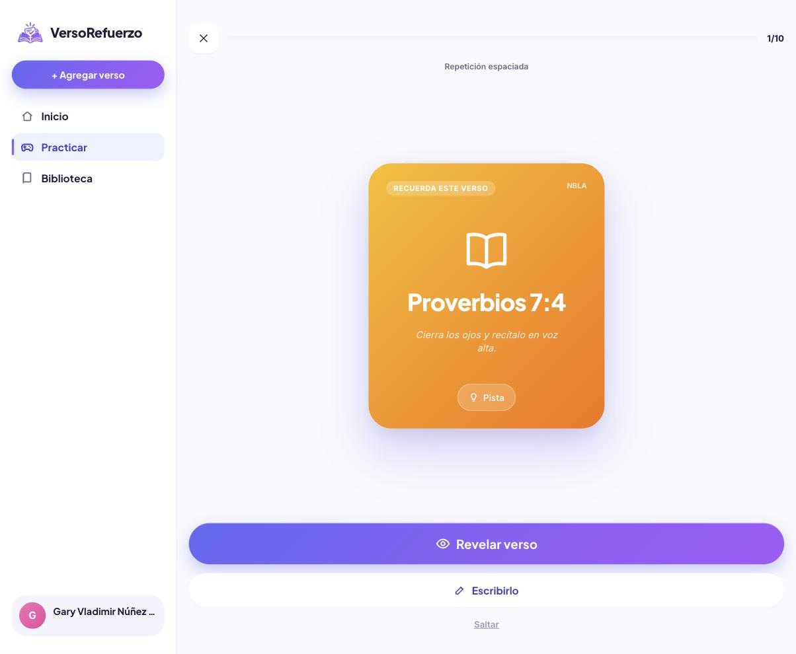 | 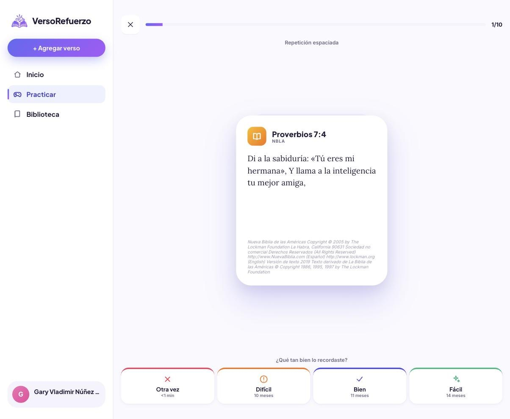 |
| **Classic practice.** Read the citation, recite the verse from memory, then reveal it. | **Grade yourself.** Otra vez, Difícil, Bien or Fácil decides when the card comes back. |
| 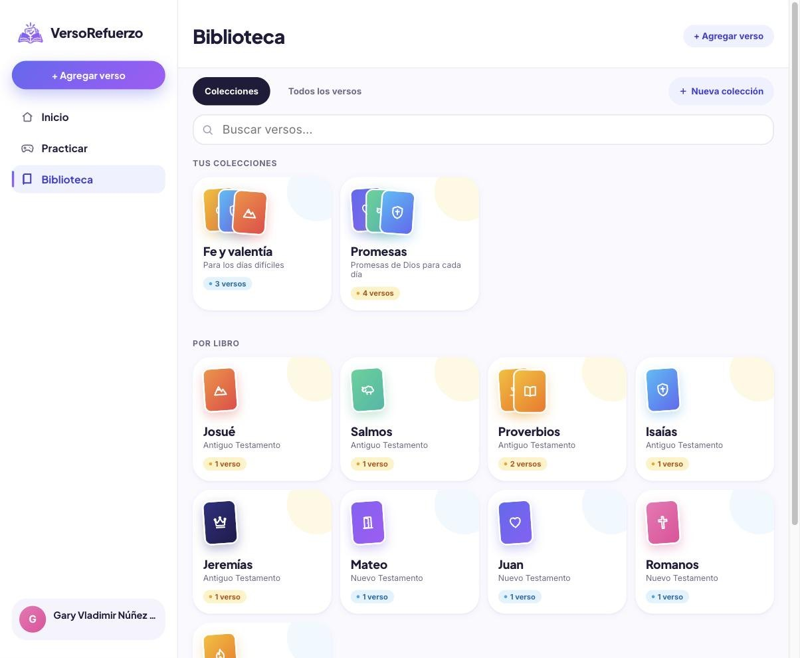 | 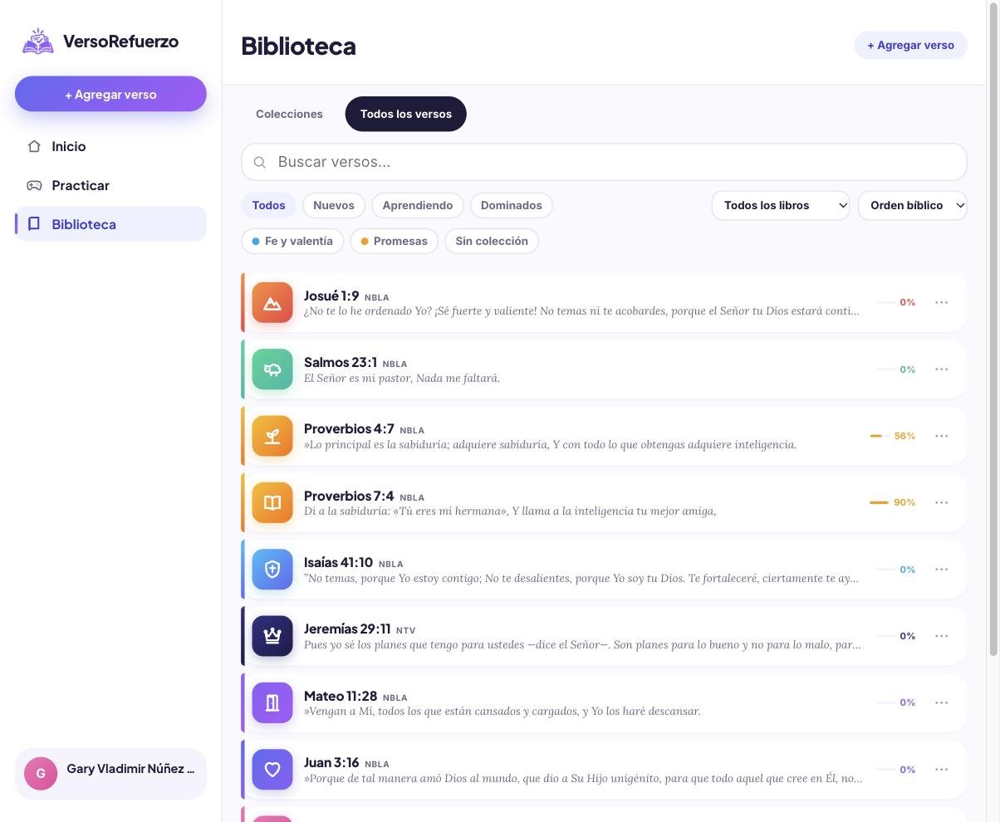 |
| **Library.** Your own collections plus automatic groups by book, testament and the Gospels. | **All verses.** Search, filter by status or collection, sorted in Bible order. |
| 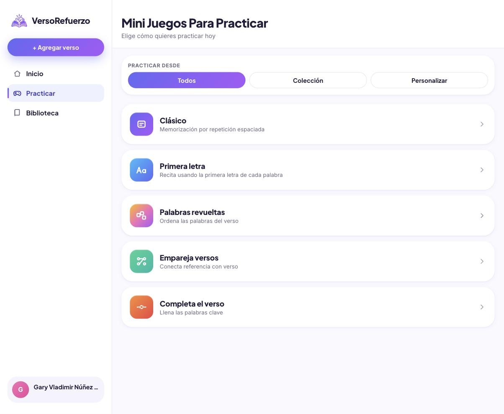 | 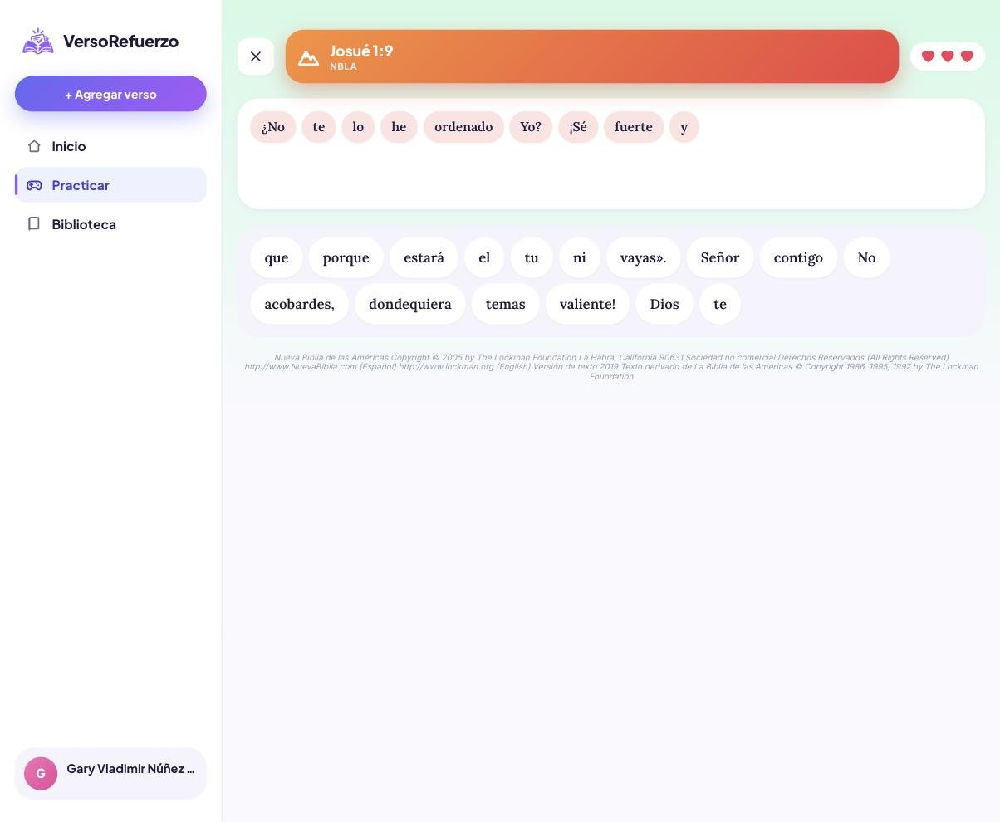 |
| **Mini Juegos Para Practicar.** Choose a mode and which verses to use. | **Palabras revueltas.** Rebuild the verse by tapping the words in order. |
| 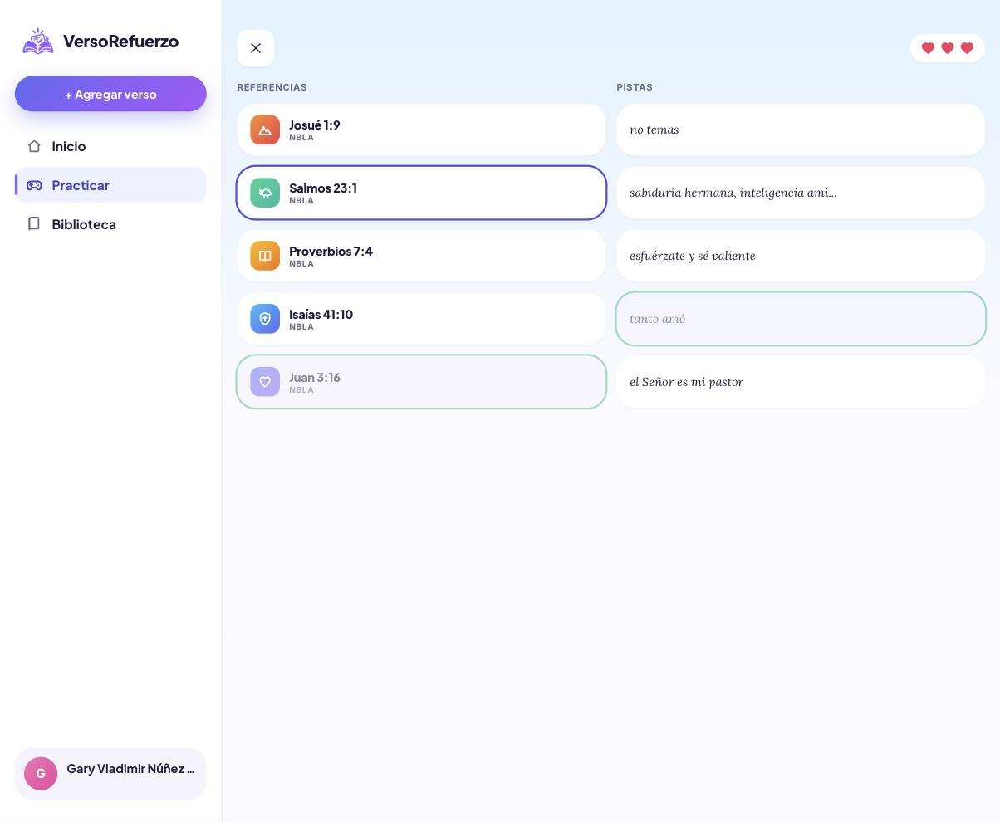 | 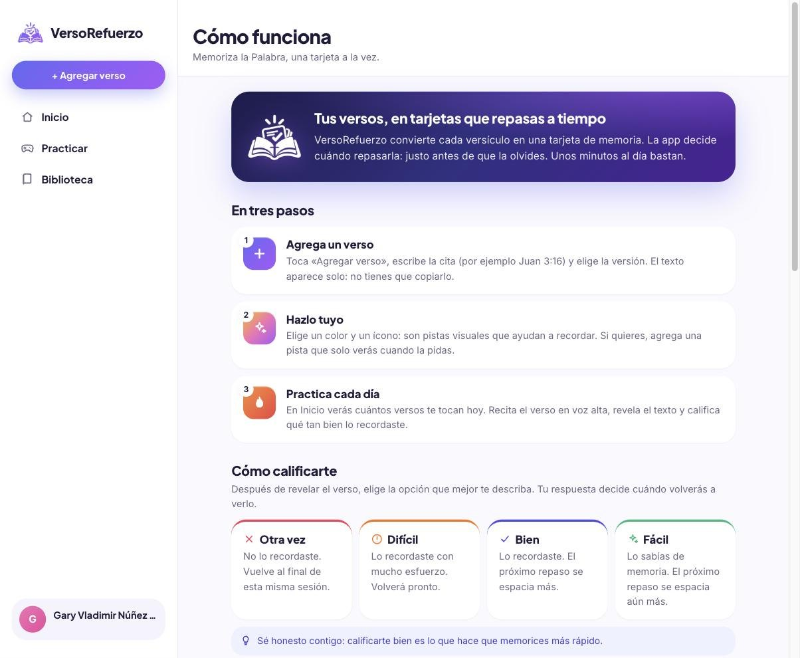 |
| **Empareja versos.** Match each citation with its hint or opening words. | **Cómo funciona.** A built-in guide to the steps, grades and modes. |

## Features

- **Add verses by citation.** Type `Filipenses 4:13`, `Sal 23:1` or a range
  like `Romanos 8:28-30`. The text is loaded from API.Bible and previewed
  before you save. No copy and paste.
- **Bible versions.** Spanish: NBLA (the default in Spanish) and NTV.
  English: NIV (the default in English). NVI and RVR1960 are supported and
  appear automatically when the API key serves them.
- **Visual memory cues.** Each card gets one of 8 colors, one of 44 icons
  (from a Bible, a dove and a lion to a triangle for the Trinity, a church,
  scales of justice and a broken heart) and an optional personal hint that
  stays hidden until you ask for it.
- **Spaced repetition.** An SM-2 scheduler picks the verses due today. Four
  honest grades control the next review; "Otra vez" brings the card back in
  the same session.
- **Five practice modes.**
  - Clásico: recite, reveal and grade. Also lets you type the verse
    ("Escribirlo") and auto-grades it.
  - Primera letra: only the first letter of each word as support.
  - Palabras revueltas: put the shuffled words back in order.
  - Empareja versos: connect citations with hints.
  - Completa el verso: choose the missing words; more blanks as you improve.
- **Practice any set.** All verses, one collection, one book group or a
  hand-picked list.
- **Library that organizes itself.** Collections you create, plus automatic
  groups for each book, the Old and New Testament and the Gospels. Bible
  order everywhere.
- **Daily streak**, verse of the day and progress counts (new, learning,
  mastered).
- **Spanish and English** on every screen, including before signing in.
  An ES / EN switch sits in the sidebar on desktop and in each screen's
  header on phones.
- **Built for phones and desktops.** Bottom tab bar on phones, sidebar on
  desktop, reduced motion support, synthesized sound effects you can mute.
- **Private by design.** Google sign-in, one private library per account,
  full account deletion.

## How the memorization works

1. **Add** a verse and personalize it with a color, an icon and a hint.
2. **Practice** what is due. Recite it out loud, reveal it and grade
   yourself honestly.
3. **The scheduler adapts.** Easy cards come back after days, then weeks,
   then months. Hard ones come back sooner. A verse counts as mastered only
   after a long unaided recall of the full text.

The mini games add variety and reinforcement. Classic and Primera letra are
the modes that move the schedule forward.

## Tech stack

| Area | Technology |
| --- | --- |
| Frontend and backend | Next.js 15 (App Router, server components, route handlers), React 19, TypeScript |
| Styling | Hand-written CSS with design tokens and a small animation layer (no UI framework) |
| Authentication | Firebase Authentication (Google), Firebase Admin SDK, HttpOnly session cookie |
| Database | Neon serverless Postgres with Drizzle ORM and versioned SQL migrations |
| Bible data | API.Bible for verse text, `bible-passage-reference-parser` for citations |
| Validation and time | Zod at every API boundary, Day.js with time zones for streaks and due dates |
| Audio | Web Audio API (sound effects are synthesized, no audio files) |
| Testing and quality | Vitest (unit and route tests), ESLint, Prettier, TypeScript strict mode |
| CI | GitHub Actions: migration check, lint, tests, build and typecheck on every push |
| Hosting | Docker image built with Cloud Build, served by Google Cloud Run behind Firebase Hosting, secrets in Secret Manager |
| Dev environment | VS Code devcontainer (Node 20, pnpm) |

## Architecture at a glance

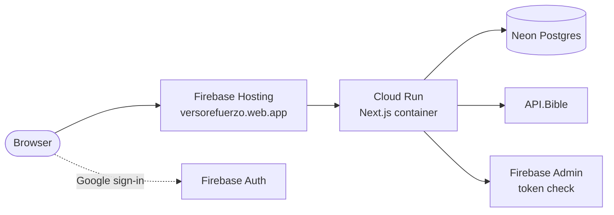

Each verse text is fetched from API.Bible at most once and cached in
Postgres for every user, so the app stays fast and well within free tiers.
See [docs/ARCHITECTURE.md](docs/ARCHITECTURE.md) for the full picture.

## Run it locally

You need Node 20 and pnpm (or just Docker with the included devcontainer),
plus free accounts on Firebase, Neon and API.Bible.

```bash
git clone https://github.com/gary-vladimir/VersoRefuerzo.git
cd VersoRefuerzo
pnpm install
cp .env.example .env      # fill in the values, see docs/DEVELOPMENT.md
pnpm db:migrate
pnpm dev                  # http://localhost:3000
```

The step by step setup, including how to get each key, is in
[docs/DEVELOPMENT.md](docs/DEVELOPMENT.md).

## Documentation

| Document | What it covers |
| --- | --- |
| [docs/DEVELOPMENT.md](docs/DEVELOPMENT.md) | Local setup, external services, environment variables, database, scripts, troubleshooting |
| [docs/ARCHITECTURE.md](docs/ARCHITECTURE.md) | How the app is built: auth, Bible text cache, scheduler, practice modes, data model, folder layout |
| [docs/TESTING.md](docs/TESTING.md) | Automated tests and a manual test plan for every feature |
| [docs/DEPLOYMENT.md](docs/DEPLOYMENT.md) | Production on Cloud Run and Firebase Hosting, sign-in setup, deploys and rollbacks |
| [specs.md](specs.md) | The original product and engineering specification |
| [PLAN.md](PLAN.md) | The milestone plan used to build v1 (historical) |
| [about.md](about.md) | The original idea, in Spanish |

## Project status

v1 is complete and live at <https://versorefuerzo.web.app>. Known
limitations are listed in [docs/TESTING.md](docs/TESTING.md#known-limitations).

## Copyright and credits

Bible text is provided by [API.Bible](https://scripture.api.bible/) and
shown with each version's copyright notice. Citations are parsed with
[Bible Passage Reference Parser](https://github.com/openbibleinfo/Bible-Passage-Reference-Parser).

Created by Gary Vladimir Núñez López. This is a non-commercial project; a
license has not been chosen yet.
