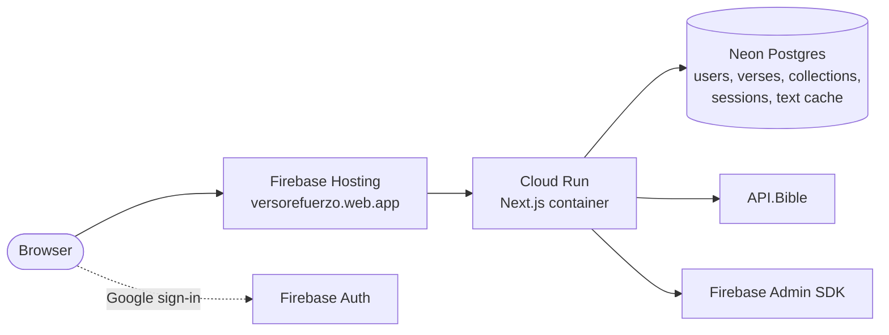
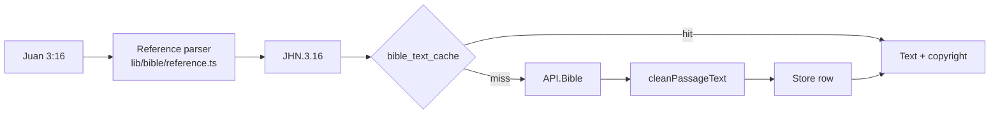
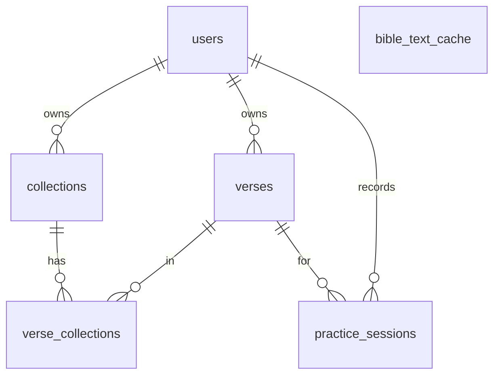

# Architecture

How VersoRefuerzo is put together. The behavior it implements is specified
in [specs.md](../specs.md); this document explains the code as it is today.

- [Overview](#overview)
- [Request flow](#request-flow)
- [Sign-in and sessions](#sign-in-and-sessions)
- [Bible text](#bible-text)
- [Spaced repetition](#spaced-repetition)
- [Practice modes](#practice-modes)
- [Streaks, stats and progress](#streaks-stats-and-progress)
- [Data model](#data-model)
- [Frontend](#frontend)
- [Folder layout](#folder-layout)

---

## Overview

One Next.js 15 application holds both the user interface and the API. It
runs as a single container on Google Cloud Run, behind Firebase Hosting,
and stores everything in Neon Postgres.



Design choices that shape the code:

- **Server components by default.** Pages read the database directly on
  the server; client components are used only where there is interaction
  (forms, practice sessions, sheets).
- **Few dependencies.** No UI framework, no state library, no animation
  library. Styling is plain CSS with design tokens.
- **Free tier first.** Bible text is cached forever and shared by all
  users, the database is serverless, and the container scales to zero.

## Request flow

1. A request reaches Firebase Hosting, which forwards every path to the
   Cloud Run service. Only the `__session` cookie is passed through.
2. `middleware.ts` runs first:
   - visits to the raw `*.run.app` URL get a permanent redirect to
     `versorefuerzo.web.app`. It reads `X-Forwarded-Host` to tell direct
     visits apart from Hosting traffic;
   - page requests without a session cookie go to `/login` (API routes
     answer 401 JSON instead);
   - the current path is forwarded as `x-pathname` for server components.
3. The page or route handler calls `getServerUser()`
   (`lib/auth/session.ts`), which verifies the cookie with the Firebase
   Admin SDK and loads the user row. It is memoized per request.
4. Route handlers validate every body with Zod (`lib/validation/`) and talk
   to Postgres through Drizzle (`db/`).

## Sign-in and sessions

- The login page uses the Firebase web SDK with Google as the only
  provider. Desktops use a popup, prepared when the page loads so browsers
  don't block it. Phones use a full-page redirect, since mobile browsers
  often block popups.
- **Same-site sign-in helper.** Firebase's helper pages (`/__/auth/*`) are
  proxied through the app's own domain (`next.config.ts` rewrite), and on
  https the client uses the current host as `authDomain`. This keeps the
  whole sign-in flow on one site, which phones that block third-party
  storage require.
- After sign-in the client posts the ID token to `POST /api/auth/session`.
  The server verifies it, creates or updates the user row, and sets a
  5-day Firebase **session cookie** named `__session` (HttpOnly, SameSite
  Lax, Secure in production). Firebase Hosting only forwards a cookie with that exact
  name.
- Sign-out (`DELETE /api/auth/session`) clears the cookie. Account deletion
  (`DELETE /api/me`) removes the user and, by cascade, all their verses,
  collections and practice history. The shared text cache is kept.

## Bible text



- **Parsing.** `lib/bible/reference.ts` wraps
  `bible-passage-reference-parser`. It accepts Spanish or English book
  names and common abbreviations, and turns them into a canonical USFM
  reference (`JHN.3.16`, `ROM.8.28-ROM.8.30`). Whole books, whole chapters
  and multi-book ranges are rejected because the API needs verse-level
  references. The same module sorts references in Bible order.
- **Fetching.** `lib/bible/apibible.ts` calls API.Bible with an 8-second
  timeout and deduplicates concurrent requests for the same passage.
  `lib/bible/text.ts` removes editorial marks such as the paragraph sign
  and collapses whitespace.
- **Caching.** Each `(reference, version)` pair is fetched once and stored
  in `bible_text_cache` with its copyright line. The cache is shared by all
  users and never invalidated, so after the first request a verse loads
  instantly for everyone.
- **Versions.** `lib/catalog.ts` lists NBLA, NTV, NVI and RVR1960. A version
  is offered only when its `APIBIBLE_ID_*` is set, and
  `GET /api/bible/versions` returns the available list.
- **Preview.** The New Verse form calls `GET /api/bible/text` 450 ms after
  the user stops typing a valid citation, so the text is cached before the
  verse is even saved.

## Spaced repetition

The scheduler lives in `lib/srs/` and is pure functions with unit tests.

- **SM-2** (`sm2.ts`). The four buttons map to grades 1, 3, 4 and 5. Passing
  grades grow the interval by the ease factor. "Fácil" gives a new card 4
  days and later multiplies the interval by 1.3, so it always schedules
  further out than "Bien". A failed card returns the same day, keeps its
  repetition count (used as exposure by the chunking and cloze ramps) and
  loses some ease. Intervals are capped at 10 years.
- **Within a session**, "Otra vez" puts the card back at the end of the
  current queue.
- **Daily queue** (`queue.ts`). Due verses are interleaved across
  collections round robin, most overdue first, with a seed per user and
  day so the order is stable for that day.
- **Long verses** (`chunk.ts`). Verses over 25 words are split at natural
  punctuation into 2 or 3 chunks, which are revealed cumulatively as
  repetitions grow.
- **Mastery** (`mastery.ts`). A percentage mixes repetitions and interval.
  The "mastered" label also requires an unaided recall of the full verse in
  the last 30 days, so playing only the games can't graduate a verse.
- **Time zones.** Due dates, "today" and streaks use the user's stored time
  zone (`lib/streak/streak.ts`), kept current by a small client component.

## Practice modes

Every mode records attempts through `POST /api/practice/sessions`, which
writes the session row and the verse update in one batch.

| Mode | Route | Class | Effect on the schedule |
| --- | --- | --- | --- |
| Clásico | `/practice/classic` | Recall | SM-2 grade from the four buttons |
| Escribirlo (inside Clásico) | same | Recall | Auto-graded by a tolerant comparison (`lib/bible/compare.ts`), can be overridden |
| Primera letra | `/practice/first-letter` | Recall | SM-2 grade |
| Palabras revueltas | `/practice/scramble` | Recognition | Small ease nudge, marks the verse practiced today |
| Empareja versos | `/practice/match` | Recognition | Same, recorded per matched pair |
| Completa el verso | `/practice/gap` | Recognition, then recall | Becomes recall once more than half the words are blank (decided on the server) |

- **Source pool** (`lib/practice/source.ts`). Every mode can draw from all
  verses, one collection, one automatic book group (`lib/bible/groups.ts`:
  a book, the Old Testament, the New Testament or the Gospels) or a
  hand-picked list. The choice travels in the query string
  (`?source=collection&collectionId=...`, `?source=book&book=PRO`,
  `?source=custom&verses=...`), so links and reloads keep the same pool.
  `?scope=all` practices the whole pool instead of only what is due.
- **Focus mode.** On phones the bottom tab bar is hidden during a session
  (`lib/layout/focus.ts`) so it never covers the session's buttons.
- **Randomness** in the games uses a seeded shuffle (`lib/random.ts`) so
  the server and client render the same order.

## Streaks, stats and progress

- `lib/streak/streak.ts` keeps the current and best streak per user, by
  local day. Missing a day resets the shown streak even before the next
  practice.
- `GET /api/stats/home` returns the numbers for Home: verses due today,
  total, learning and mastered (new is what remains), plus the streak.
- Verse of the day, the recent list and the "Cómo funciona" card are
  rendered on the Home page itself.

## Data model

Defined in `db/schema.ts`, migrated with Drizzle (`db/migrations/`).



| Table | Holds |
| --- | --- |
| `users` | Google identity, display name, locale, sound setting, time zone, current and best streak |
| `verses` | Canonical reference, version, icon, color, hint, SM-2 state (JSON), mastery, status, last practiced time, soft-delete time |
| `collections` | Name, description, color, soft-delete time |
| `verse_collections` | Many-to-many link between verses and collections |
| `practice_sessions` | One row per attempt: mode, recall or recognition, grade, outcome, duration, hint use |
| `bible_text_cache` | Shared verse text and copyright per reference and version |

Deleting a verse or collection is a soft delete with a 5-second undo; the
row is removed for good by a cleanup step on the next list read.

## Frontend

- **Layout.** `components/layout/AppShell.tsx` wraps every signed-in page:
  a sidebar on screens 1024px and wider, a bottom tab bar below that, and
  the profile sheet.
- **Design system.** Colors, gradients, radii and shadows are CSS variables
  in `styles/tokens.css`; animations are in `styles/animations.css`. The
  site forces a light color scheme so dark-mode extensions don't recolor
  it. The original visual reference is in `DesignBundle/`.
- **Icons.** 18 verse icons and the navigation icons are hand-drawn SVG
  components (`components/icons/`, `components/layout/NavIcons.tsx`).
- **Language.** All interface text is in `lib/i18n/` (Spanish and English);
  the user's choice is stored on their account.
- **Sound.** `lib/sounds/player.ts` synthesizes five short cues with the
  Web Audio API: flip, pluck, thud, chime and flame.
- **Resilience.** Route-level error, not-found and loading screens, so a
  database or API outage shows a recoverable card instead of a blank page.

## Folder layout

```text
app/
  (auth)/login/         Sign-in page
  (app)/                Signed-in pages: Home, guide, onboarding, library,
                        practice (hub, five modes, summary), verses (new, view, edit)
  api/                  Route handlers: auth/session, me, bible/{text,versions},
                        verses, collections, practice/{queue,sessions},
                        stats/home, health
  privacy/, terms/      Public legal pages
components/             UI by area: layout, home, verse, practice, icons, ui, legal
lib/
  auth/                 Firebase client and admin, session cookie, getServerUser
  bible/                Reference parsing, API.Bible client, text cleanup,
                        book groups, tokenizing, typed-answer comparison
  srs/                  SM-2, queue, chunking, cloze, scramble, mastery
  practice/             Source pools and queue loading
  streak/               Time-zone aware streaks
  i18n/                 Interface strings and the guide content
  layout/               Focus mode for practice sessions
  sounds/               Synthesized sound effects
  validation/           Zod schemas
db/                     Drizzle schema, client and migrations
styles/                 Design tokens and animations
assets/brand/           Logo files
tests/                  Vitest suites
scripts/                deploy.sh, cloudbuild.yaml, check-migrations.mjs
middleware.ts           Canonical host redirect and sign-in gate
Dockerfile              Production image (Next.js standalone output)
DesignBundle/           The original visual design prototypes
```
