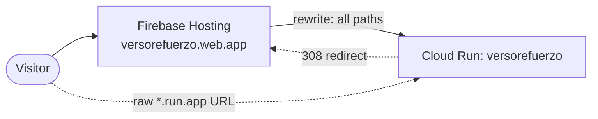

# Deployment

VersoRefuerzo runs on Google Cloud Run behind Firebase Hosting. This guide
describes the production setup, how to recreate it from scratch, how to
ship a new version and how to roll back.

- [Production at a glance](#production-at-a-glance)
- [One-time setup](#one-time-setup)
- [Deploy a new version](#deploy-a-new-version)
- [Roll back](#roll-back)
- [Connect a custom domain](#connect-a-custom-domain)
- [Costs](#costs)
- [Troubleshooting](#troubleshooting)

---

## Production at a glance

| Piece | Value |
| --- | --- |
| Public address | <https://versorefuerzo.web.app> (Firebase Hosting) |
| Google Cloud project | `versorefuerzo` |
| Cloud Run service | `versorefuerzo`, region `us-central1`, public, scales to zero |
| Container images | Artifact Registry repository `versorefuerzo` in `us-central1` |
| Database | Neon Postgres (connection string in Secret Manager) |
| Secrets | Secret Manager: `DATABASE_URL`, `FIREBASE_CLIENT_EMAIL`, `FIREBASE_PRIVATE_KEY`, `APIBIBLE_KEY` |
| Plain settings | `FIREBASE_PROJECT_ID`, `APIBIBLE_ID_NBLA`, `APIBIBLE_ID_NTV`, `APIBIBLE_ID_NIV` (and NVI / RVR1960 when available) |



- Firebase Hosting forwards every path to Cloud Run and only passes the
  cookie named `__session`, which is why the session cookie has that name.
- `middleware.ts` redirects visits to the raw `*.run.app` URL to the main
  address, so there is a single public site. It reads `X-Forwarded-Host`
  to tell direct visits from Hosting traffic.
- Firebase's sign-in helper pages (`/__/auth/*`) are proxied through the
  app (`next.config.ts`), so sign-in stays on `versorefuerzo.web.app`. That
  is what makes Google sign-in work on phones.

## One-time setup

You need the `gcloud` CLI, logged in with an owner of the project, and
billing linked to the project (usage stays within free tiers, but Cloud
Build and Cloud Run require a billing account).

### 1. Enable the APIs

```bash
gcloud config set project versorefuerzo
gcloud services enable run.googleapis.com artifactregistry.googleapis.com \
  cloudbuild.googleapis.com secretmanager.googleapis.com firebasehosting.googleapis.com
```

### 2. Create the image repository

```bash
gcloud artifacts repositories create versorefuerzo \
  --repository-format=docker --location=us-central1
```

### 3. Store the secrets

With your production values loaded in the shell (for example from `.env`):

```bash
for s in DATABASE_URL FIREBASE_CLIENT_EMAIL FIREBASE_PRIVATE_KEY APIBIBLE_KEY; do
  printf '%s' "${!s}" | gcloud secrets create "$s" --data-file=-
done
```

To change a secret later, add a new version:
`printf '%s' "$VALUE" | gcloud secrets versions add NAME --data-file=-`,
then deploy again.

### 4. Grant the build and runtime permissions

Cloud Build and Cloud Run both use the project's default compute service
account (`PROJECT_NUMBER-compute@developer.gserviceaccount.com`). It needs:

| Role | Why |
| --- | --- |
| `roles/secretmanager.secretAccessor` | Read the secrets at runtime |
| `roles/artifactregistry.writer` | Push the built image |
| `roles/logging.logWriter` | Write build logs |
| `roles/storage.objectViewer` | Read the uploaded source during the build |

```bash
SA="$(gcloud projects describe versorefuerzo --format='value(projectNumber)')-compute@developer.gserviceaccount.com"
for role in secretmanager.secretAccessor artifactregistry.writer logging.logWriter storage.objectViewer; do
  gcloud projects add-iam-policy-binding versorefuerzo \
    --member="serviceAccount:$SA" --role="roles/$role"
done
```

### 5. First deploy

Run the deploy described in [Deploy a new version](#deploy-a-new-version).
It creates the Cloud Run service.

### 6. Put Firebase Hosting in front

Add Firebase to the same Google Cloud project, then point the default
Hosting site at the Cloud Run service. With the Firebase CLI, a
`firebase.json` like this does it (`hosting-empty` is an empty folder; it
must not contain an `index.html`, or Hosting would serve that instead of
the app):

```json
{
  "hosting": {
    "public": "hosting-empty",
    "rewrites": [
      { "source": "**", "run": { "serviceId": "versorefuerzo", "region": "us-central1" } }
    ]
  }
}
```

```bash
firebase deploy --only hosting --project versorefuerzo
```

This only needs to be done once. New app versions reach Hosting
automatically because the rewrite always targets the latest Cloud Run
revision.

### 7. Allow Google sign-in on the public address

1. **Firebase console → Authentication → Settings → Authorized domains**:
   add `versorefuerzo.web.app`.
2. **Google Cloud console → APIs & Services → Credentials**, open the OAuth
   web client that Firebase created ("Web client (auto created by Google
   Service)"):
   - Authorized JavaScript origins: `https://versorefuerzo.web.app`
   - Authorized redirect URIs: `https://versorefuerzo.web.app/__/auth/handler`
3. Keep `NEXT_PUBLIC_FIREBASE_AUTH_DOMAIN` set to the project's
   `firebaseapp.com` domain. It is the target of the `/__/auth` proxy; the
   browser itself uses the current host as the auth domain on https.

## Deploy a new version

From the repo root, with the production values in `.env`:

```bash
set -a && . ./.env && set +a
PROJECT_ID=versorefuerzo REGION=us-central1 ./scripts/deploy.sh
```

`scripts/deploy.sh`:

1. builds the Docker image with Cloud Build (`scripts/cloudbuild.yaml`),
   baking the public `NEXT_PUBLIC_FIREBASE_*` values into the client bundle;
2. pushes it to Artifact Registry;
3. deploys it to Cloud Run with the plain settings and the Secret Manager
   references.

A deploy takes several minutes, most of it the image build. Each one creates a new revision
(`versorefuerzo-000NN-xxx`) that receives all traffic once it is healthy.

**Check it:**

```bash
curl -s https://versorefuerzo.web.app/api/health
gcloud run revisions list --service versorefuerzo --region us-central1 --limit 3
```

Then sign in on the site and open a practice session.

**Database migrations** are not run by the deploy. When a release includes
a new migration, apply it first, against the production database:

```bash
pnpm db:migrate
```

## Roll back

Every deploy keeps the previous revisions. To send all traffic back to an
earlier one:

```bash
gcloud run revisions list --service versorefuerzo --region us-central1
gcloud run services update-traffic versorefuerzo --region us-central1 \
  --to-revisions=versorefuerzo-000NN-xxx=100
```

The next `deploy.sh` run moves traffic to the new revision again.

## Connect a custom domain

When a domain such as `versorefuerzo.app` is bought:

1. Firebase console → Hosting → **Add custom domain**, and create the DNS
   records it asks for.
2. Add the domain to Firebase's authorized domains and to the OAuth client
   (origin `https://DOMAIN`, redirect URI `https://DOMAIN/__/auth/handler`).
3. Change `CANONICAL_HOST` in `middleware.ts` to the new domain and deploy.

## Costs

The app is designed to stay inside free tiers:

- **Cloud Run** scales to zero when nobody is using it. The trade-off is a
  cold start of a few seconds on the first visit after a quiet period.
- **Neon** free tier holds the whole database comfortably.
- **API.Bible** is called once per verse and version; the shared cache
  serves every later request.
- **Firebase Hosting and Authentication** stay within the free Spark limits
  for this traffic.
- **Cloud Build** and **Artifact Registry** have monthly free allowances;
  delete old images occasionally if storage grows.

## Troubleshooting

**Build fails with `Cannot read properties of null` in `next/font`.** The
build downloads Google Fonts and the download occasionally fails. Run the
deploy again.

**Cloud Build permission errors.** One of the roles in step 4 is missing on
the compute service account.

**Signed in, but every request returns 401.** The session cookie is not
reaching the app. Through Firebase Hosting it must be named `__session`.
Also check that `FIREBASE_PROJECT_ID` matches the web config project.

**Phones show "missing initial state" or return to the login page.** The
sign-in flow left the site. Confirm the `/__/auth` rewrite in
`next.config.ts`, the authorized domain and the OAuth redirect URI from
step 7.

**`auth/unauthorized-domain`.** The address in the browser is not in
Firebase's authorized domains.

**The raw `*.run.app` URL redirects to `web.app`.** This is expected; see
[Production at a glance](#production-at-a-glance).
